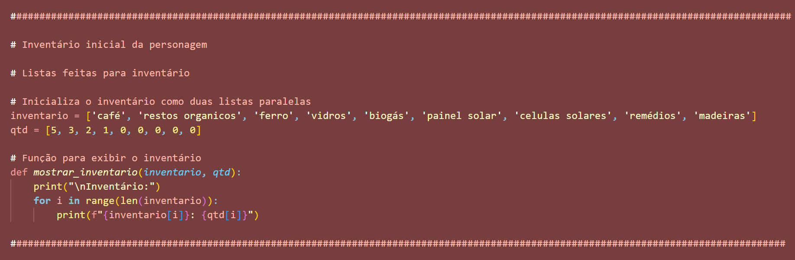
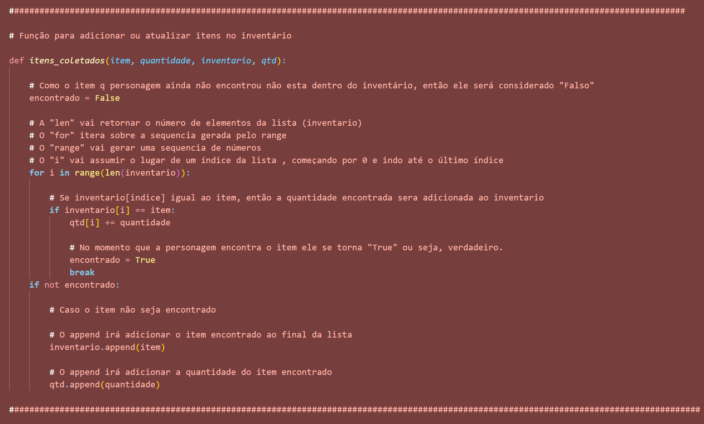
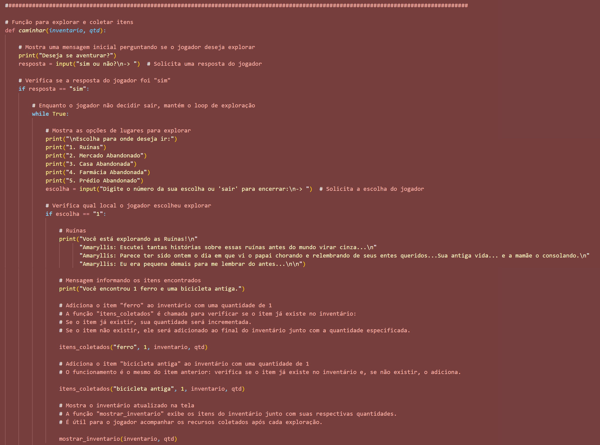
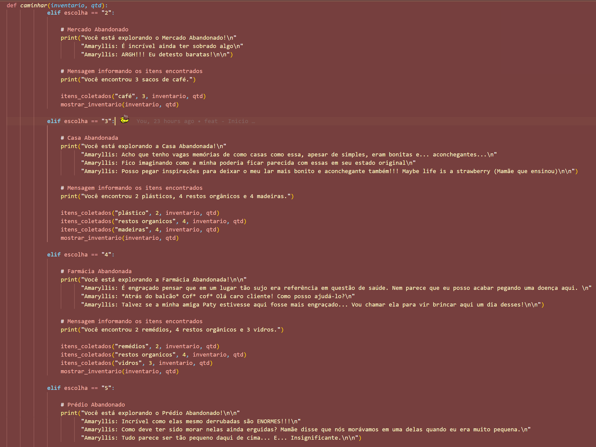
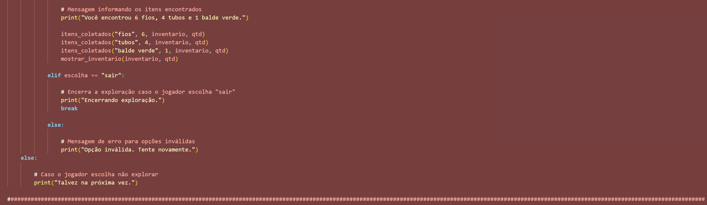
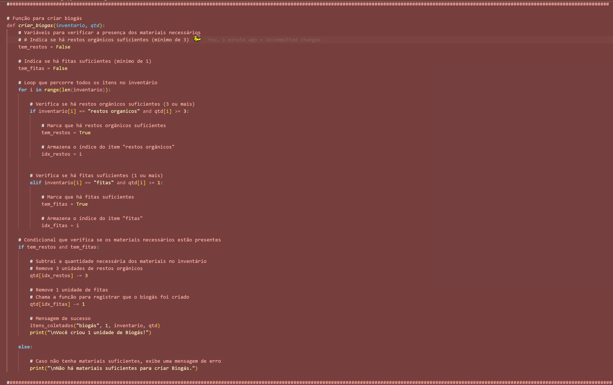
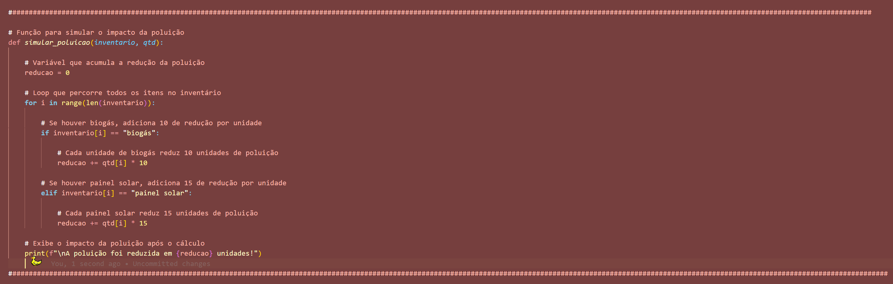
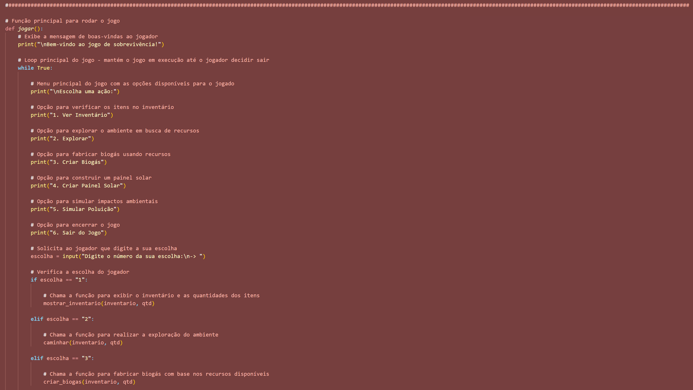

<h1 align="center">🌱𝙶𝚕𝚘𝚋𝚊𝚕 𝚂𝚘𝚕𝚞𝚝𝚒𝚘𝚗 - 𝙿𝚢𝚝𝚑𝚘𝚗🌱</h1>
 
 

**𝘔𝘢𝘤𝘳𝘰 𝘗𝘳𝘰𝘫𝘦𝘵𝘰🪴**  

𝙰𝚖𝚊𝚛𝚢𝚕𝚕𝚒𝚜: 𝚃𝚑𝚎 𝙶𝚛𝚎𝚎𝚗 𝙴𝚗𝚍 é um jogo desenvolvido no intuito de concientizar e incentivar os jogadores a procurar formas alternativas de energia positiva contando a história de Amaryllis, uma garota de 13 anos que se encontra habitando um mundo em 2027 destruido por guerras e uso exarcebado de recursos naturais a ponto de trazer escasses ao planeta.
Com sua mãe que possui tosses frequentes e seu pai acamado por uma doença grave respiratória, Amary, como é mais conhecida por aqueles ao seu redor, procura por meios para melhorara as condições de vida da sua familia, mas ainda ciente do lugar onde vive e o levou a aquele estado ela procura por meio de energia limpa trazer pureza ao ar para sua familia, comunidade e hortas criadas por si mesma. Apesar dos desafios Amaryllis possui uma esperança de trazer de voltar a viver em um mundo saudavel, mas infelizmente o mundo tem o seu limite, e é justamente isso o que queremos mostrar. Depois do limite é irreverssível.

**𝘔𝘪𝘤𝘳𝘰 𝘗𝘳𝘰𝘫𝘦𝘵𝘰🪴**  

Desenvolvemos um jogo interativo de múltipla escolha inteiramente no CPython. Em 𝙰𝚖𝚊𝚛𝚢𝚕𝚕𝚒𝚜: 𝚃𝚑𝚎 𝙶𝚛𝚎𝚎𝚗 𝙴𝚗𝚍 haverá pensamentos e falas da protagonista, escolha de lugares para explorar e descobrir novos itens para futuramente serem usados em criações de itens com a funcionalidade voltada 100% para uso de 𝘨𝘳𝘦𝘦𝘯 𝘦𝘯𝘦𝘳𝘨𝘺, assim incentivando o público a se concientizar da sua importancia vendo através da narrativa contada pela própria protagonista até onde o nosso mundo pode chegar se continuar com o uso exarcebado de recursos naturais e como a enrgia limpa é a solução para a sobrevivencia em um mundo que esta cada vez mais doente.

**𝘛𝘦𝘤𝘯𝘰𝘭𝘰𝘨𝘪𝘢𝘴 𝘜𝘵𝘪𝘭𝘪𝘻𝘢𝘥𝘢𝘴🍃**  

-    : Para criação do jogo

**𝘗𝘳𝘰𝘨𝘳𝘢𝘮𝘢𝘴 𝘜𝘴𝘢𝘥𝘰𝘴🍃**  

-    : PyCharm
-    : VSCode
  

**𝘌𝘴𝘵𝘳𝘶𝘵𝘶𝘳𝘢𝘴 𝘥𝘦 𝘊𝘰𝘯𝘵𝘳𝘰𝘭𝘦 𝘥𝘦 𝘍𝘭𝘶𝘹𝘰 𝘦 𝘍𝘶𝘯𝘤̧𝘰̃𝘦𝘴 𝘊𝘰𝘮𝘶𝘯𝘴 𝘯𝘰 𝘗𝘳𝘰𝘫𝘦𝘵𝘰🍃** 

- If, Else
- Range
- While
- Uso de lista
- Uso de varíaveis
- For
- Def
- Booleano
- Break
- True, False
- Len
  

**𝘐𝘯𝘷𝘦𝘯𝘵𝘢́𝘳𝘪𝘰 𝘐𝘯𝘪𝘤𝘪𝘢𝘭🍃**

**𝘐𝘵𝘦𝘯𝘴 𝘊𝘰𝘭𝘦𝘵𝘢𝘥𝘰𝘴🍃**

**𝘌𝘹𝘱𝘭𝘰𝘳𝘢𝘤̧𝘢̃𝘰🍃**

**𝘊𝘳𝘪𝘢𝘳 𝘉𝘪𝘰𝘨𝘢́𝘴🍃**

**𝘊𝘳𝘪𝘢𝘳 𝘗𝘢𝘪𝘯𝘦𝘭 𝘚𝘰𝘭𝘢𝘳🍃**

**𝘚𝘪𝘮𝘶𝘭𝘢𝘳 𝘗𝘰𝘭𝘶𝘪𝘤̧𝘢̃𝘰🍃**

**𝘙𝘰𝘥𝘢𝘳 𝘑𝘰𝘨𝘰🍃**

**𝘊𝘰𝘮𝘰 𝘌𝘹𝘦𝘤𝘶𝘵𝘢𝘳 𝘰 𝘗𝘳𝘰𝘫𝘦𝘵𝘰🍃**  

Link explicativo do projeto : https://youtu.be/FK79lPj5NQ4

Para executar o projeto localmente por meio de um Fork:

1. Fazer um Fork do repositório original.
2. Clonar o repositório Forkado para o seu computador.
3. Fazer modificações e enviar (push) de volta ao GitHub.

**𝘋𝘦𝘴𝘦𝘯𝘷𝘰𝘭𝘷𝘦𝘥𝘰𝘳𝘢𝘴 𝘥𝘰 𝘗𝘳𝘰𝘫𝘦𝘵𝘰🍃**

- 𝙶𝚊𝚋𝚛𝚒𝚎𝚕𝚊 𝚀𝚞𝚎𝚒𝚛𝚘𝚐𝚊      560035
- 𝙶𝚒𝚝𝙷𝚞𝚋    https://github.com/gabiqueiroga1
- 𝙻𝚒𝚗𝚔𝚎𝚍𝚒𝚗   https://www.linkedin.com/in/gabriela-queiroga-493260338/
  

- 𝙹𝚞𝚕𝚒𝚊 𝚂𝚊𝚢𝚞𝚛𝚒 𝚈𝚘𝚔𝚘𝚘    560541
- 𝙶𝚒𝚝𝙷𝚞𝚋    https://github.com/JulikaTV
- 𝙻𝚒𝚗𝚔𝚎𝚍𝚒𝚗   https://www.linkedin.com/in/julia-yokoo-491797215/
  

- 𝙼𝚊𝚛𝚒𝚊 𝙴𝚍𝚞𝚊𝚛𝚍𝚊 𝙵𝚎𝚛𝚛𝚎́𝚜   560418
- 𝙶𝚒𝚝𝙷𝚞𝚋    https://github.com/dudaferres
- 𝙻𝚒𝚗𝚔𝚎𝚍𝚒𝚗   https://www.linkedin.com/in/mariaeduardaferres/

**𝙻𝚒𝚌𝚎𝚗𝚌̧𝚊🏛️**  
Este projeto está licenciado sob a Licença MIT. Veja o arquivo [LICENSE](./LICENSE) para mais detalhes.
